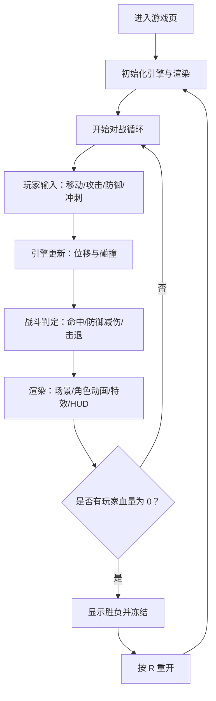

## 1. 产品概述
一个浏览器端同屏双人像素风机甲对战小游戏 Demo，以“赛博霓虹”复古街机氛围为核心，提供移动、攻击、防御、冲刺/重击与血量胜负结算，打开即玩、按键明确、回合节奏紧凑。

## 2. 核心功能
### 2.1 用户角色
本 Demo 无登录与角色系统，默认两名玩家同屏对战。

### 2.2 功能模块
1. **游戏主界面**：对战场景、像素渲染、角色动画、特效反馈
2. **HUD 与提示层**：血条、技能冷却、胜负提示、按键说明、重开提示

### 2.3 页面详情
| 页面名称 | 模块名称 | 功能描述 |
|---|---|---|
| 游戏页（/） | 画布渲染区 | 使用像素化 Canvas 渲染赛博霓虹场景与两名机甲、特效、受击反馈 |
| 游戏页（/） | 顶部 HUD | P1/P2 血条、冲刺冷却指示、回合状态（进行中/胜负） |
| 游戏页（/） | 操作说明区 | 展示默认键位，强调“按 R 重开” |

## 3. 核心流程
### 3.1 用户流程描述
- 用户打开页面，默认进入对战。
- 两名玩家分别使用键盘操控机甲移动、攻击、防御与冲刺。
- 命中造成扣血并触发像素特效与击退；防御可显著减伤。
- 任意一方血量归零触发胜负提示并冻结战斗；按 R 重开一局。

### 3.2 流程图（Mermaid）

## 4. 用户界面设计
### 4.1 设计风格
- 主题：赛博霓虹像素风（深色底 + 霓虹青/紫/粉高光 + 黄色火花点缀）
- 画面：像素化渲染（整数倍缩放 + `image-rendering: pixelated`），UI/HUD 采用“街机面板”质感
- 字体：优先使用等宽/像素感的字体栈（本地可用为主），HUD 字号偏小但清晰对比
- 按钮/提示：像素描边矩形、轻微发光，胜负提示使用强对比大字
- 动效：受击闪白、命中火花、护盾闪烁、轻微屏幕震动（可选）

### 4.2 页面设计概览
| 页面名称 | 模块名称 | UI 元素 |
|---|---|---|
| 游戏页（/） | 顶部 HUD | 双方血条（霓虹描边）、冲刺 CD（条形/圆点）、状态文字（READY/FIGHT/KO） |
| 游戏页（/） | 中央画布 | 320×180 逻辑分辨率，场景为霓虹网格地面 + 远景楼群剪影 |
| 游戏页（/） | 说明区 | 键位表（P1/P2 分列）、重开提示（R） |

### 4.3 响应式
- 桌面优先：在宽屏下居中显示，画布按整数倍缩放到可用空间。
- 小屏适配：缩放到最大可容纳的整数倍；说明区可折叠为一个“Controls”面板（实现上可先保持常显）。

## 5. 操作与规则（对玩家可见）
### 5.1 默认键位
- P1：W/A/S/D 移动；J 轻攻击；K 防御（按住）；L 冲刺/重击
- P2：↑/↓/←/→ 移动；1 轻攻击；2 防御（按住）；3 冲刺/重击
- R：重开

### 5.2 战斗规则（简述）
- 轻攻击：短距离正前方判定，命中扣血并轻击退，有冷却。
- 防御：按住减伤并降低击退，移动变慢。
- 冲刺/重击：短距离快速位移，有冷却；冲刺命中产生更强击退并更高伤害。
