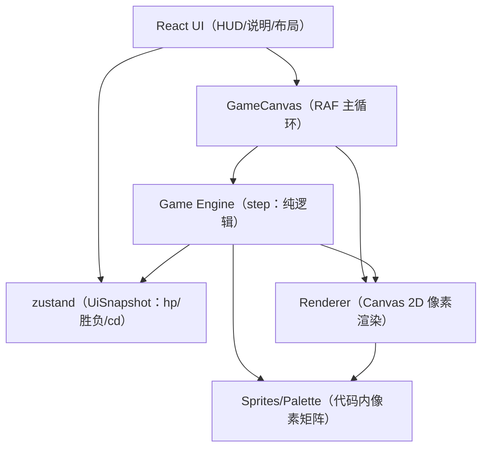

## 1. 架构设计

## 2. 技术说明
- 前端：React@18 + TypeScript + Vite
- 样式：tailwindcss@3（HUD/布局），Canvas 渲染负责像素画面
- 状态：zustand 仅管理 UI 可观察快照；游戏状态由引擎持有（避免每帧触发 React 渲染）
- 后端：无
- 数据：无持久化，仅内存态

## 3. 路由定义
| 路由 | 目的 |
|---|---|
| / | 游戏主页面：Canvas 对战 + HUD + 操作说明 |

## 4. 接口与数据结构（前端内）
### 4.1 UI 快照（Engine -> UI）
- `hpP1: number`
- `hpP2: number`
- `winner: "p1" | "p2" | null`
- `dashCooldownP1: number`（0~1 或秒数）
- `dashCooldownP2: number`
- `phase: "ready" | "fight" | "ko"`

### 4.2 引擎输入（UI -> Engine）
- 每帧传入 `InputState`（P1/P2 的移动向量、attack/defend/dash 按键状态与边沿触发）

## 5. 渲染策略与性能预算
- 逻辑分辨率固定 320×180，渲染到离屏 canvas，再按整数倍绘制到可见 canvas，开启像素化显示以避免模糊。
- 每帧绘制上限：背景一次（或少量分层）、两名角色、少量特效（< 50 粒子/闪点），保持稳定 60 FPS。

## 6. 目录结构（目标）
- `src/pages/GamePage.tsx`
- `src/components/GameCanvas.tsx`
- `src/store/useGameUiStore.ts`
- `src/game/types.ts`
- `src/game/config.ts`
- `src/game/input.ts`
- `src/game/engine.ts`
- `src/game/render/renderer.ts`
- `src/game/render/sprites.ts`
- `src/game/render/effects.ts`
